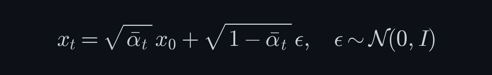
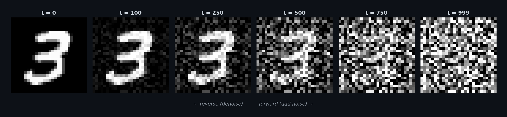

<p align="center">
  
</p>

<h1 align="center">Diffusion From Scratch</h1>

<p align="center">
  <em>Understanding diffusion models by building them, one equation at a time.</em>
</p>

<p align="center">
  <a href="site/index.html"></a>
  <a href="#setup"></a>
  <a href="docs/papers.md"></a>
</p>

<p align="center">
  
</p>

---

Diffusion models turn static into pictures. Start with an image, add noise until it's unrecognizable, then train a neural network to undo it one step at a time. That's the engine behind Stable Diffusion, DALL·E, and Sora.

We cover this framework, broken up into themed lectures tracing a narrative path suited for learning: the forward process, U-Net architecture, training, DDPM/DDIM sampling, classifier-free guidance, latent diffusion, DiT, and flow matching. All with interactive diagrams, inline math with intuition, and pseudocode you can trace through.

## Course Outline

| Module | Lectures | Topics |
|--------|----------|--------|
| **The Diffusion Framework** | 1–3 | Generative models landscape, forward process, noise schedules, reverse process, simplified loss |
| **The Denoising Network** | 4–5 | U-Net encoder-decoder, skip connections, sinusoidal time embeddings, spatial attention |
| **Training & Sampling** | 6–7 | Training loop with EMA, DDPM sampling, DDIM, accelerated generation |
| **Controllable Generation** | 8–9 | Class conditioning, classifier guidance, classifier-free guidance, cross-attention |
| **Scaling Diffusion** | 10–11 | VAEs, latent diffusion, Stable Diffusion, prediction targets, advanced schedules |
| **Modern Architectures** | 12–13 | Diffusion Transformers (DiT), flow matching, rectified flows |
| **Assessment Track** | — | Coding challenges, conceptual Q&A, debug exercise, system design |

## The Website

The lectures are hosted at **[maninae.github.io/diffusion-from-scratch](https://maninae.github.io/diffusion-from-scratch/)**. Dark theme, KaTeX math, SVG diagrams, interactive elements.

> **Prerequisites:** CS231N-level deep learning (CNNs, backprop, attention basics), PyTorch, and introductory probability.

## Setup

The original Jupyter notebooks are preserved in `legacy-notebooks/` for hands-on coding exercises.

```bash
python3 -m venv .venv
source .venv/bin/activate
pip install -r requirements.txt
```

Open any notebook in VS Code (select the `.venv` kernel) or run `jupyter notebook`. Runs on Apple Silicon (MPS) or CPU — no CUDA required.

## Papers

Every concept links back to its source paper. See [docs/papers.md](docs/papers.md) for the full reading list.

## Structure

```
site/                   # Course website (13 lectures + assessment)
├── index.html          # Homepage
├── lectures/           # Individual lecture pages
├── styles/             # Dark ocean theme CSS
└── scripts/            # Sidebar nav, KaTeX, interactives

legacy-notebooks/       # Original Jupyter notebooks (exercises)
utils/                  # Shared PyTorch code (U-Net, schedules, viz)
docs/                   # Lecture specs & paper references
assets/                 # README images
```

---
